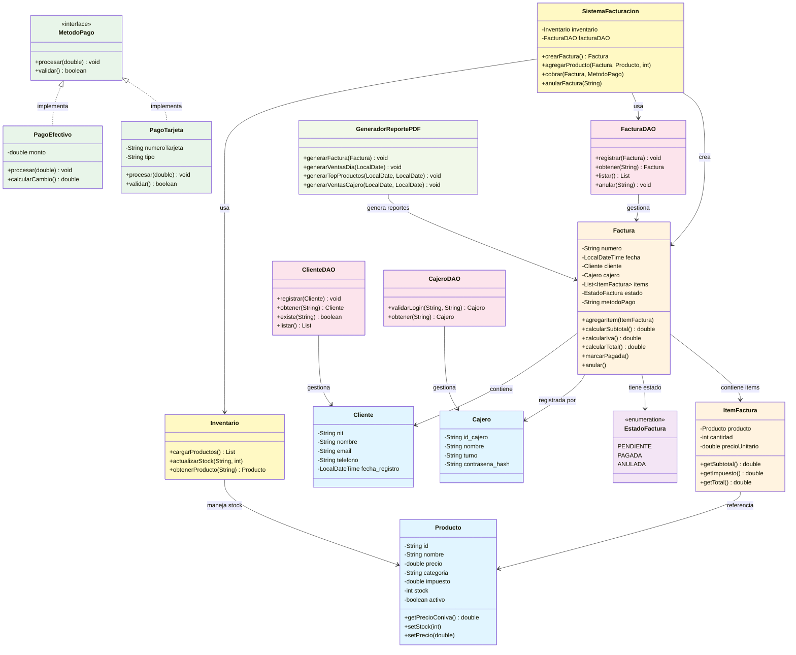

# Sistema de Facturacion Electronica - Supermercado
### Guia de instalacion y ejecucion en VS Code

---

## REQUISITOS PREVIOS

Instala estas herramientas antes de comenzar:

| Herramienta | Version | Descarga |
|-------------|---------|----------|
| Java JDK    | 17 o superior | https://adoptium.net |
| Maven       | 3.8+    | https://maven.apache.org/download.cgi |
| MySQL       | 8.0+    | https://dev.mysql.com/downloads/installer |
| VS Code     | Ultima  | https://code.visualstudio.com |

**Extensiones de VS Code necesarias:**
- Extension Pack for Java (Microsoft)  →  busca en Extensions: `vscjava.vscode-java-pack`

---

## PASO 1 — Configurar MySQL

Abre MySQL Workbench o la terminal de MySQL y ejecuta el script de instalacion:

```bash
mysql -u root -p < setup.sql
```

O copia y pega el contenido de `setup.sql` en MySQL Workbench y ejecutalo.

Esto crea:
- La base de datos `supermercado_db`
- Las 6 tablas con sus relaciones
- 12 productos de prueba
- 2 cajeros de prueba

**Cajeros de prueba:**

| ID   | Nombre        | Contrasena |
|------|---------------|------------|
| C001 | Administrador | admin123   |
| C002 | Caja 2        | 1234       |

---

## PASO 2 — Configurar la conexion en el codigo

Abre el archivo:
```
src/main/java/supermercado/db/ConexionDB.java
```

Edita estas 3 lineas con tus datos de MySQL:
```java
private static final String URL      = "jdbc:mysql://localhost:3306/supermercado_db...";
private static final String USUARIO  = "root";         // tu usuario MySQL
private static final String PASSWORD = "tu_password";  // tu contrasena MySQL
```

---

## PASO 3 — Abrir en VS Code

1. Abre VS Code
2. `File → Open Folder` → selecciona la carpeta `supermercado`
3. VS Code detectara automaticamente el proyecto Maven
4. Aparecera una notificacion: **"Build the project?"** → clic en **Yes**
5. Maven descargara las dependencias automaticamente (requiere internet, ~2 minutos)

---

## PASO 4 — Ejecutar el programa

**Opcion A — Desde VS Code:**
- Abre `src/main/java/supermercado/Main.java`
- Clic en el boton **Run** (▶) que aparece sobre el metodo `main`

**Opcion B — Desde la terminal:**
```bash
# En la carpeta raiz del proyecto:
mvn compile
mvn exec:java -Dexec.mainClass="supermercado.Main"
```

**Opcion C — Con el debugger:**
- Presiona `F5` (usa la configuracion en `.vscode/launch.json`)

---

## ESTRUCTURA DEL PROYECTO

```
supermercado/
├── pom.xml                          ← Dependencias Maven
├── setup.sql                        ← Script de base de datos MySQL
├── .vscode/
│   ├── launch.json                  ← Configuracion de ejecucion
│   └── settings.json
└── src/main/java/supermercado/
    ├── Main.java                    ← Punto de entrada
    ├── db/
    │   └── ConexionDB.java          ← Conexion MySQL (EDITAR PASSWORD AQUI)
    ├── modelo/
    │   ├── Producto.java
    │   ├── Cliente.java
    │   ├── Cajero.java
    │   ├── ItemFactura.java
    │   ├── Factura.java
    │   └── EstadoFactura.java       ← Enum: PENDIENTE, PAGADA, ANULADA
    ├── dao/
    │   ├── FacturaDAO.java          ← Operaciones BD para facturas
    │   ├── ClienteDAO.java
    │   └── CajeroDAO.java
    ├── servicio/
    │   ├── SistemaFacturacion.java  ← Logica principal (Singleton)
    │   └── Inventario.java
    ├── pago/
    │   ├── MetodoPago.java          ← Interface
    │   ├── PagoEfectivo.java
    │   └── PagoTarjeta.java
    ├── reporte/
    │   └── GeneradorReportePDF.java ← 4 tipos de reportes PDF
    └── ui/
        ├── LoginFrame.java          ← Pantalla de login
        ├── MenuPrincipalFrame.java  ← Menu principal
        ├── NuevaVentaFrame.java     ← Punto de venta (POS)
        ├── InventarioFrame.java     ← Ver productos y stock
        ├── ClienteFrame.java        ← Registrar / buscar clientes
        ├── ReportesFrame.java       ← Generar reportes PDF
        └── BuscarFacturaFrame.java  ← Consultar / anular facturas
```

---

## DIAGRAMA UML - CLASES Y RELACIONES



---

## FUNCIONALIDADES

### Modulo de Ventas (POS)
- Buscar productos por nombre o codigo
- Agregar al carrito con cantidad
- Doble clic en producto = agregar rapido
- Pago en efectivo (calcula cambio automaticamente)
- Pago con tarjeta debito / credito
- Genera PDF de la factura automaticamente al cobrar

### Reportes PDF (carpeta `reportes/`)
- **Factura individual:** `reportes/facturas/FAC-XXXXX.pdf`
- **Ventas del dia:** `reportes/ventas_YYYY-MM-DD.pdf`
- **Top 20 productos:** `reportes/top_productos_DESDE_HASTA.pdf`
- **Ventas por cajero:** `reportes/ventas_cajero_DESDE_HASTA.pdf`

### Gestion
- Inventario con stock en tiempo real
- Registro y busqueda de clientes por NIT
- Anulacion de facturas con registro en BD
- Login con autenticacion SHA-256

---

## AGREGAR CAJEROS NUEVOS

Para agregar un cajero con su contrasena, ejecuta en MySQL:

```sql
-- Ejemplo: agregar cajero con contrasena "mipass"
INSERT INTO cajeros (id_cajero, nombre, turno, contrasena_hash)
VALUES ('C003', 'Maria Lopez', 'MAÑANA', SHA2('mipass', 256));
```

---

## SOLUCIONAR PROBLEMAS COMUNES

**Error: "Communications link failure"**
→ MySQL no esta corriendo. Inicia el servicio MySQL.

**Error: "Unknown database supermercado_db"**
→ No ejecutaste el script setup.sql. Ejecutalo primero.

**Error: "Access denied for user root"**
→ La contrasena en ConexionDB.java es incorrecta.

**Maven no descarga dependencias**
→ Verifica tu conexion a internet y ejecuta: `mvn dependency:resolve`

**No aparece el boton Run en VS Code**
→ Instala la extension "Extension Pack for Java" y recarga VS Code.
